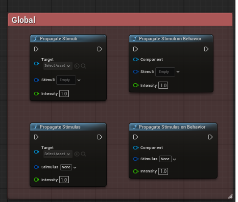
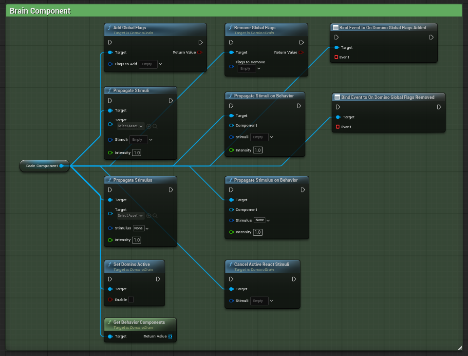
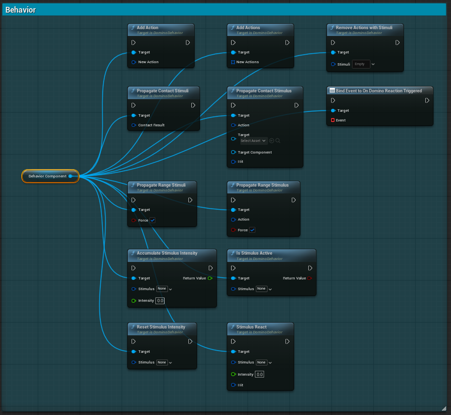

# API Reference

This section documents the public API exposed by the plugin.

The API is divided into three logical layers:

- Global
- Brain Component
- Behavior Component

Each layer exposes different responsibilities within the systemic framework.

---

# Global

The Global API exposes utility functions used to interact with the systemic framework at a high level.

These functions are typically static helpers and can be accessed from both C++ and Blueprint.

| Function Name                   | Description                                                                                                                                             |
| ------------------------------- | ------------------------------------------------------------------------------------------------------------------------------------------------------- |
| **PropagateStimuli**            | Propagates multiple Stimulus through the systemic framework on an actor. Each Stimulus is evaluated and dispatched to eligible Behaviors and Reactions. |
| **PropagateStimuliOnBehavior**  | Propagates multiple Stimulus directly on a specific Behavior Component. Only that Behavior will process and evaluate the provided Stimuli.              |
| **PropagateStimulus**           | Propagates a single Stimulus to the target Actor.                                                                                                       |
| **PropagateStimulusOnBehavior** | Propagates a single Stimulus directly to a specific Behavior Component.                                                                                 |

---

# Brain Component API

The Brain Component API exposes Actor-level systemic controls.

The Brain is the central decision layer and registry for all Behavior Components attached to an Actor.

| Function Name                   | Description                                                                                                                                              |
| ------------------------------- | -------------------------------------------------------------------------------------------------------------------------------------------------------- |
| **AddGlobalFlags**              | Adds one or more global flags to the Brain. These flags can influence Reaction eligibility and systemic decision-making across all registered Behaviors. |
| **RemoveGlobalFlags**           | Removes one or more global flags from the Brain, potentially re-enabling or disabling specific Reactions.                                                |
| **PropagateStimuli**            | Propagates multiple Stimulus through the systemic framework on an actor. Each Stimulus is evaluated and dispatched to eligible Behaviors and Reactions.  |
| **PropagateStimuliOnBehavior**  | Propagates multiple Stimulus directly on a specific Behavior Component. Only that Behavior will process and evaluate the provided Stimuli.               |
| **PropagateStimulus**           | Propagates a single Stimulus to the target Actor.                                                                                                        |
| **PropagateStimulusOnBehavior** | Propagates a single Stimulus directly to a specific Behavior Component.                                                                                  |
| **SetDominoActive**             | Enables or disables the systemic processing on the Brain. When inactive, incoming Stimuli will not trigger Reactions.                                    |
| **CancelActiveReactStimuli**    | Cancels currently active React Stimuli being processed by the Brain, effectively interrupting ongoing systemic chains.                                   |
| **GetBehaviorComponents**       | Returns all Behavior Components currently registered to the Brain.                                                                                       |
| **OnDominoGlobalFlagsAdded**    | Event triggered when one or more global flags are added to the Brain. Can be used for reactive logic or debugging.                                       |
| **OnDominoGlobalFlagsRemoved**  | Event triggered when one or more global flags are removed from the Brain.                                                                                |

---

# Behavior Component API

The Behavior Component API exposes localized systemic functionality tied to a specific PrimitiveComponent.

It represents a physical interaction zone capable of emitting Actions and reacting to Stimuli.

| Function Name                   | Description                                                                                                                |
| ------------------------------- | -------------------------------------------------------------------------------------------------------------------------- |
| **AddAction**                   | Adds a single Action to the Behavior Component at runtime. The new Action can emit Stimuli according to its configuration. |
| **AddActions**                  | Adds multiple Actions to the Behavior Component at runtime, allowing dynamic expansion of stimulus emission capabilities.  |
| **RemoveActionsWithStimuli**    | Removes all Actions associated with specific Stimuli types from the Behavior Component.                                    |
| **PropagateContactStimuli**     | Propagates multiple contact-based Stimuli (typically triggered via collision or overlap events).                           |
| **PropagateContactStimulus**    | Propagates a single contact-based Stimulus triggered by physical interaction.                                              |
| **PropagateRangeStimuli**       | Propagates multiple range-based Stimuli affecting Actors within a defined radius.                                          |
| **PropagateRangeStimulus**      | Propagates a single range-based Stimulus within a specified area.                                                          |
| **AccumulateStimulusIntensity** | Accumulates intensity for a given Stimulus over time, enabling threshold-based Reactions or progressive systemic effects.  |
| **ResetStimulusIntensity**      | Resets the accumulated intensity of a given Stimulus.                                                                      |
| **StimulusReact**               | Forces the Behavior to evaluate and process a specific Stimulus immediately, triggering eligible Reactions.                |
| **IsStimulusActive**            | Returns whether a specific Stimulus is currently active on this Behavior Component.                                        |
| **OnDominoReactionTriggered**   | Event triggered when a Reaction is successfully activated on this Behavior Component.                                      |

---

# Architecture Summary

| Layer              | Scope                      | Responsibility                      |
| ------------------ | -------------------------- | ----------------------------------- |
| Global             | System-wide                | Utilities and manual control        |
| Brain Component    | Actor-wide                 | Central registry and decision layer |
| Behavior Component | Local (PrimitiveComponent) | Action/Reaction logic               |
