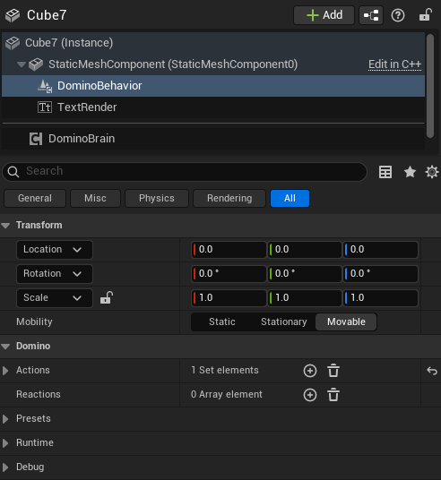
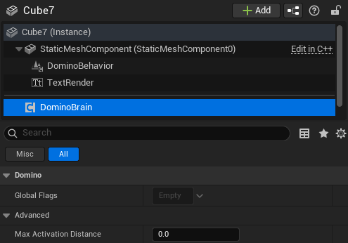

# Brain and Behavior components

## Brain Component

The Brain Component is required on any Actor that owns one or more Behavior Components.

It acts as:

- A **registry** for all Behavior Components attached to the Actor
- A container for **global flags** active at the Actor level
- A shared decision layer that Behavior Components can query

An Actor may have multiple Behavior Components attached to different Primitive Components, but it must have **only one Brain Component**.

---

## Behavior Component

The Behavior Component is responsible for handling localized systemic logic on an Actor.

It is a `SceneComponent` that must be attached to a `PrimitiveComponent`, allowing it to emit and receive stimuli through the attached component’s `OnHit` and `OnOverlap` events.

---

## Behavior vs Brain

**Behavior Component**

- Is a `SceneComponent`
- Must be attached to a `PrimitiveComponent`, allowing it to interact through the component’s `OnHit` and `OnOverlap` events for contact-based stimulus propagation
- Represents localized logic tied to a specific physical part of an Actor

Contains:

- Actions
- Reactions
- Local component flags

**Brain Component**

- Exists once per Actor
- Is not tied to a specific primitive
- Provides shared state and coordination

Contains:

- Global Actor-level flags
- References to registered Behavior Components

---

### Why This Separation Exists

This separation allows:

- Multiple localized behaviors (e.g., head, body, weapon, sensor)
- A centralized Actor-level state (e.g., Alerted, Disabled, Powered)
- Clean separation between physical interaction zones and global logic

For example:

- A Behavior Component attached to a weapon may emit a **Noise** stimulus.
- A different Behavior Component attached to the character’s body may react to damage.
- Both can query the Brain to check if the Actor has a global flag such as **IsAlerted**.

The Brain ensures consistency across all behaviors without tightly coupling them together.
