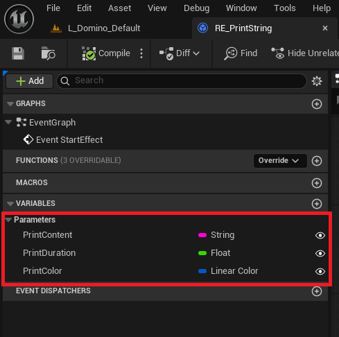
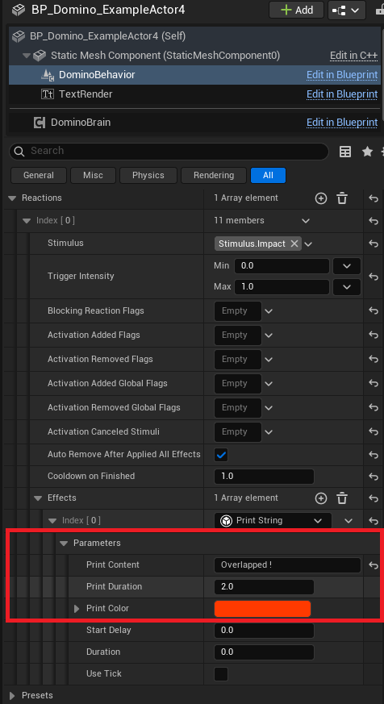

# Reaction Effects

A **Reaction Effect** represents a concrete modification to the game world or to an Actor’s state.

It is the execution layer of the system.

!!! info "Example"

    - Applying damage
    - Modifying a Meta-Property
    - Triggering an animation or sound
    - Applying a force or impulse

    Effects are:

    - Stateless
    - Reusable
    - Executed as a result of a Reaction

    Effects may optionally emit new Stimuli, enabling chained or systemic interactions.

## Creating Custom Effects

You can create your own Reaction Effects in **Blueprint** or **C++**.

The base class is: `UDominoReactionEffect`

It derives from `UGameplayTask`, allowing time-based execution, ticking, delays, and duration control.

---

## Creating an Effect in Blueprint

1. Create a new Blueprint class.
2. Inherit from `DominoReactionEffect`.
3. Override the desired Blueprint events:
   - `CanApplyEffect`
   - `StartEffect`
   - `TickEffect`
   - `FinishEffect`

Blueprint-only effects are fully supported and do not require C++.

---

## Creating an Effect in C++

To create a custom effect in C++:

```cpp
UCLASS()
class YOURPROJECT_API UMyCustomEffect : public UDominoReactionEffect
{
    GENERATED_BODY()

protected:

    virtual void StartEffect_Implementation() override;
    virtual void TickEffect_Implementation(float DeltaTime) override;
    virtual void FinishEffect_Implementation(bool bWasCancelled) override;
};
```

You can override:

- CanApplyEffect_Implementation()
- StartEffect_Implementation()
- TickEffect_Implementation()
- FinishEffect_Implementation()

## Core Effect Parameters

Each effect automatically receives contextual data:
Stimulus Context

- Stimulus → The GameplayTag of the triggering stimulus
- Intensity → The accumulated intensity value
- SelfActor → The owning Actor
- Hit → Associated HitResult (if applicable)

These values are BlueprintReadOnly and can be used inside your logic.
Timing Control

Effects support built-in timing parameters:

- StartDelay → Delay before StartEffect is called
- Duration → Duration before automatic finish (0 = infinite)
- bUseTick → Enables ticking via TickEffect

This allows you to implement:

- Timed buffs
- Progressive damage
- Charging effects
- Temporary states

## Effect Execution Flow

When triggered, an Effect follows this lifecycle:

    CanApplyEffect()
    → Validates whether the effect should execute

    StartEffect()
    → Called after StartDelay

    TickEffect() (if bUseTick is true)
    → Called every frame during Duration

    FinishEffect()
    → Called when duration ends or effect is cancelled

!!! danger "Important"

    `FinishEffect()` must be called manually in your implementation.
    If it is not called, the underlying `UGameplayTask` will never complete, which means:

    - The Reaction that triggered the effect will remain active
    - Any subsequent effects or state changes may not execute
    - Delays, duration timers, or ticked effects may not stop

    Always ensure that FinishEffect() is invoked at the end of your effect logic, whether the effect finishes naturally or is cancelled.

## Built-in Reaction Effects

The plugin comes with a set of pre-built **Reaction Effects** to cover common gameplay scenarios.  
These effects can be used directly in Blueprints or C++, and serve as examples for creating custom effects.

| Effect Name                          | Description                                                                                                                                                                       |
| ------------------------------------ | --------------------------------------------------------------------------------------------------------------------------------------------------------------------------------- |
| **AddMetaProperty**                  | Adds or modifies a Meta-Property on the owning Actor or on another target Actor. Useful for triggering state changes or quantitative effects shared across systems.               |
| **RemoveMetaProperty**               | Removes a Meta-Property from the owning Actor or another target. Used to reset or clear state conditions.                                                                         |
| **ApplyDamage**                      | Applies damage to an Actor. Supports standard Unreal damage types and can integrate with health systems.                                                                          |
| **AbortStimuli**                     | Cancels specific Stimuli or stops their propagation. Useful to interrupt ongoing systemic interactions.                                                                           |
| **DestroySelfActor**                 | Destroys the Actor owning this effect. Can be used for destructible objects, consumables, or self-terminating systems.                                                            |
| **ManageFlags**                      | Adds or removes local Behavior flags or global Brain flags. Allows controlling Reaction activation or global state changes.                                                       |
| **SpawnCascadeParticle**             | Spawns a legacy Cascade particle system at a specific location or attached to a component.                                                                                        |
| **SpawnNiagaraParticle**             | Spawns a Niagara particle system at a specific location or attached to a component. Supports parameter overrides for dynamic effects.                                             |
| **SpawnAudio**                       | Plays a sound at a location or attached to a component. Useful for reactive audio feedback to stimuli.                                                                            |
| **ApplyImpulseOppositeHitDirection** | Applies a physics impulse to a component or Actor.                                                                                                                                |
| **AddComponent**                     | Dynamically adds a component to an Actor. Useful for temporary sensors, effect markers, or modular Actor behavior.                                                                |
| **SpawnActor**                       | Spawns a new Actor in the world. Can be used for projectiles, summoned entities, or environmental objects.                                                                        |
| **AddActions**                       | Adds new Actions to a Behavior Component at runtime. Allows dynamic modification of the emitter side of the system.                                                               |
| **PropagateStimulusToSelf**          | Immediately propagates a new Stimulus to the owning Actor’s Brain. Useful for chaining internal systemic reactions or transforming an incoming stimulus into another one locally. |
| **PropagateStimulusInRange**         | Propagates a new Stimulus to all valid Actors within a defined radius. Enables area-based systemic interactions such as environmental chain reactions.                            |

---

### Exposing Configurable Parameters

You can expose variables in **C++** or **Blueprint** that you want to make configurable from a Preset or a Behavior Component.



Any exposed variable can then be adjusted directly within the Preset or the Behavior configuration, allowing flexible and reusable effect customization.

By default, built-in effect parameters use the category:

**"Parameters"**

You can use the same category for consistency or define your own custom categories if needed.


